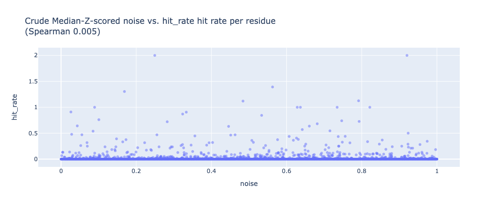

# Analysis of historical fragment hits in Fragalysis
> :construction: This is work that was in progress and requires more, but I am doing other things :construction:

## Rationale

In my current strategies I sort virtual hits via multiple properties and cluster by interactions.
For sorting "risk" is solely how much of the template hit is retained.
But in expansions some things work better than others.

Interactions are enthalpic, but entropy is also important due to:

**Rigidification** (entropic penalty): sidechains and ligand become more rigid.
The loss of 1 degree of rotational freedom is on the one kcal/mol. This is visible via the B-factors.

**Induced fit** (entropic penalty): the protein changes shape to accommodate the ligand.
In terms of sidechains, if it is not in the correct orientation then the k_on rate will be lower.

**Desolvation** (entropic gain): freeing waters from the binding site, 
means more particles in solution, which is entropically favourable (cf. chelate effect).

> For more see this 
[OPIG blog post](https://www.blopig.com/blog/2023/11/demystifying-the-thermodynamics-of-ligand-binding/)

## Method

Fragalysis historical data downloaded. PLIP annotated.

* Download, see [download](notebooks/mass_download.ipynb)
* Analyses see [bfactor](notebooks/bfactor.ipynb)
* Analyses 2 see [bfactor](notebooks/bfactor-extra.ipynb)

## Results

Data downloaded, normalized and PLIP annotated.
Caveat: normalizing the B-factors by Z-score normalisation is very common, but they are not gaussian distributed.

Does normalized B-factor correlate with number of hits found? 0.05 Spearman correlation is poor.
This includes residues that form no interactions with ligands.

Bla bla bla